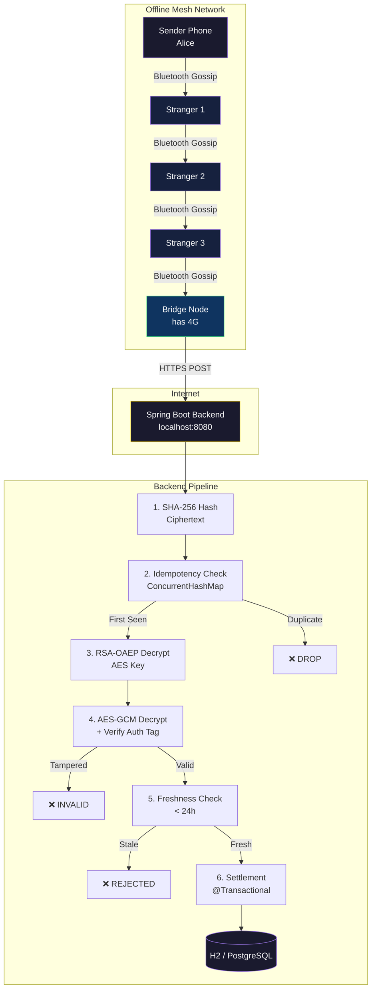
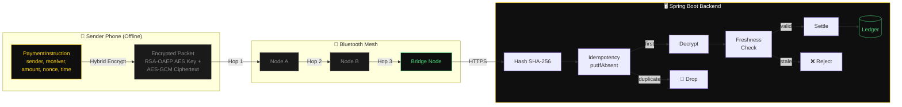
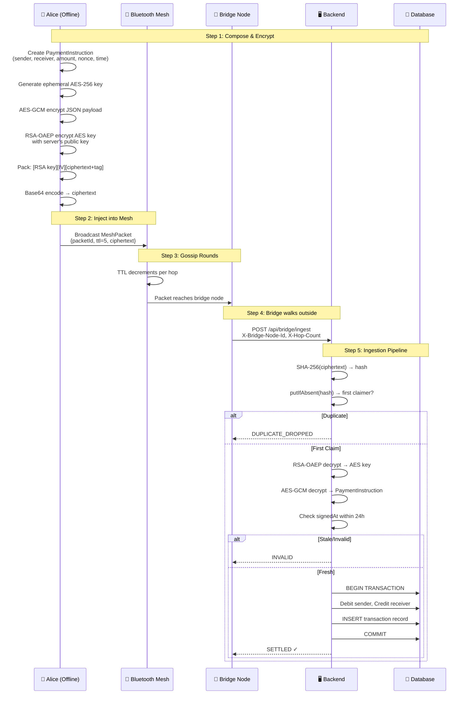
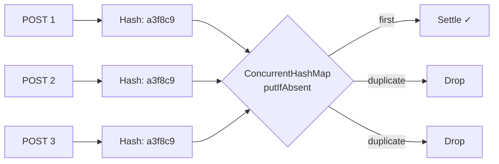

# UPI Offline Mesh — Offline UPI Payments via Bluetooth Mesh Network

[](https://adoptium.net)
[](https://spring.io/projects/spring-boot)
[](LICENSE)
[](https://github.com/Aaditya022/UPI_Without_Internet/pulls)

> **Send money from a basement with zero internet.** Encrypted payment packets hop device-to-device via Bluetooth until one phone walks outside, hits 4G, and uploads to the backend. **Hybrid RSA + AES-GCM encryption**, **atomic idempotency**, and **defense-in-depth settlement** — all running on a single laptop for demo.

Built by [**Aaditya**](https://github.com/Aaditya022)

---

## Table of Contents

- [System Architecture](#system-architecture)
- [Data Flow](#data-flow)
- [Payment Lifecycle](#payment-lifecycle)
- [Encryption Scheme](#encryption-scheme)
- [Three Hard Problems](#three-hard-problems)
  - [1. Untrusted Intermediaries](#1-untrusted-intermediaries)
  - [2. Duplicate Storm](#2-duplicate-storm)
  - [3. Replay Attacks](#3-replay-attacks)
- [Project Structure](#project-structure)
- [Quick Start](#quick-start)
- [API Reference](#api-reference)
- [Frontend Landing Page](#frontend-landing-page)
- [Testing](#testing)
- [Production Roadmap](#production-roadmap)
- [Limitations](#limitations)
- [License](#license)

---

## System Architecture



---

## Data Flow



---

## Payment Lifecycle



---

## Encryption Scheme

```mermaid
flowchart TB
    subgraph Encrypt["🔐 Sender Encrypts"]
        JSON[PaymentInstruction JSON<br/>~300 bytes] --> AESP[AES-256-GCM Encrypt]
        KEY[Random AES-256 Key<br/>32 bytes] --> AESP
        IV[Random IV<br/>12 bytes] --> AESP
        AESP --> CT[AES Ciphertext + 16-byte GCM Tag]
        KEY --> RSA[RSA-OAEP Encrypt<br/>with Server Public Key]
        RSA --> EK[Encrypted AES Key<br/>256 bytes]
        EK --> PACK
        IV --> PACK
        CT --> PACK
        PACK[Pack: EK + IV + CT] --> B64[Base64 Encode]
        B64 --> WIRE[Wire Format: single base64 string]
    end

    subgraph Decrypt["🔓 Server Decrypts"]
        WIRE2[Wire Format] --> UNB64[Base64 Decode]
        UNB64 --> UNPACK[Unpack: EK + IV + CT]
        UNPACK --> RSA2[RSA-OAEP Decrypt<br/>with Server Private Key]
        RSA2 --> KEY2[AES-256 Key]
        UNPACK --> IV2[IV]
        UNPACK --> CT2[AES Ciphertext + Tag]
        KEY2 --> AESD[AES-256-GCM Decrypt]
        IV2 --> AESD
        CT2 --> AESD
        AESD -->|GCM Tag Validates| JSON2[PaymentInstruction]
        AESD -->|Tag Mismatch| FAIL[❌ Exception<br/>Tamper Detected]
    end

    style Encrypt fill:#0f0f0f,color:#ffd400,stroke:#ffd400
    style Decrypt fill:#0f0f0f,color:#4ade80,stroke:#4ade80
    style FAIL fill:#1a1a1a,color:#ff6b35,stroke:#ff6b35
    style WIRE fill:#1a1a1a,color:#888,stroke:#2d2d2d
    style WIRE2 fill:#1a1a1a,color:#888,stroke:#2d2d2d
```



---

## Three Hard Problems

### 1. Untrusted Intermediaries

A stranger's phone carries your transaction. How do you stop them from reading or modifying it?

**Solution: Hybrid Encryption (RSA-OAEP + AES-256-GCM)**

```
┌─────────────────────────────────────────────────────────────────────┐
│                         Wire Format                                  │
│  ┌──────────────────────┬──────────┬────────────────────────────┐   │
│  │ RSA-Encrypted AES Key│ GCM IV  │ AES-GCM Ciphertext + Tag  │   │
│  │     256 bytes        │ 12 bytes│     variable length        │   │
│  └──────────────────────┴──────────┴────────────────────────────┘   │
└─────────────────────────────────────────────────────────────────────┘
```

- **AES-256-GCM** encrypts the actual payment payload (fast + authenticated)
- **RSA-OAEP** encrypts just the ephemeral AES key (solves RSA size limit)
- **GCM auth tag** detects any bit-flip tampering — decryption throws immediately
- Same scheme used by **TLS 1.3**, **Signal Protocol**, and **PGP**

**Why not pure RSA?** RSA-2048 can only encrypt ~245 bytes. Our JSON payload often exceeds that. The hybrid pattern scales to arbitrarily large payloads while keeping the security of RSA key exchange.

### 2. Duplicate Storm

Three bridge nodes hold the same packet. They all walk outside simultaneously. Three concurrent POSTs hit the server. How do you settle exactly once?

**Solution: Atomic Compare-and-Set on Ciphertext Hash**

```java
// IdempotencyService.java
Instant prev = seen.putIfAbsent(packetHash, now);
return prev == null;  // true = first claimer, false = duplicate
```



**Why hash the ciphertext, not the packetId?**

| Key | Problem |
|---|---|
| `packetId` | Malicious intermediate can rewrite it |
| Cleartext JSON | Requires decrypt first (slow + exposes data) |
| **Ciphertext** | **Byte-identical for same payment. GCM-authenticated. Can hash before decrypt.** |

**Defense in depth:** The `transactions.packet_hash` column has a UNIQUE index. If the cache layer fails, the database rejects the second insert.

**Production path:** Replace `ConcurrentHashMap` with **Redis `SET key NX EX 86400`** — same semantics, distributed across replicas.

### 3. Replay Attacks

An attacker captures a ciphertext and replays it weeks later.

**Solution: Two independent layers**

| Layer | Mechanism | Bypass |
|---|---|---|
| **Freshness window** | `signedAt` epoch inside encrypted payload. Server rejects packets older than 24h. | Cannot modify `signedAt` without breaking GCM auth tag |
| **Idempotency cache** | Byte-identical ciphertext → same hash → `putIfAbsent` rejects duplicates | Cannot create same ciphertext without same AES key + IV + payload |

**Nonce ensures legitimate repeats settle correctly:** If Alice sends Bob ₹100 twice, each has a unique UUID nonce → different plaintext → different ciphertext → different hash → both settle.

---

## Project Structure

```
upi-offline-mesh/
├── pom.xml                              Maven build, Spring Boot 3.3, Java 17
├── mvnw / mvnw.cmd                      Maven wrapper (zero setup)
├── README.md                            ← you are here
│
├── src/main/java/com/demo/upimesh/
│   ├── UpiMeshApplication.java          Entry point
│   │
│   ├── model/                           Domain layer
│   │   ├── Account.java                 JPA entity with @Version (optimistic lock)
│   │   ├── AccountRepository.java       Spring Data JPA
│   │   ├── Transaction.java             Ledger entry, unique constraint on packet_hash
│   │   ├── TransactionRepository.java   Spring Data JPA
│   │   ├── MeshPacket.java              Wire format for Bluetooth gossip
│   │   └── PaymentInstruction.java      Decrypted payload
│   │
│   ├── crypto/                          Cryptography
│   │   ├── ServerKeyHolder.java         RSA-2048 keygen on startup
│   │   └── HybridCryptoService.java     RSA-OAEP + AES-256-GCM
│   │
│   ├── service/                         Business logic
│   │   ├── DemoService.java             Seeds accounts, simulates sender phone
│   │   ├── VirtualDevice.java           Simulated phone in the mesh
│   │   ├── MeshSimulatorService.java    Gossip protocol simulation
│   │   ├── IdempotencyService.java      ConcurrentHashMap = JVM Redis SETNX
│   │   ├── SettlementService.java       @Transactional debit/credit
│   │   └── BridgeIngestionService.java  THE pipeline: hash → claim → decrypt → freshness → settle
│   │
│   ├── controller/                      HTTP layer
│   │   ├── ApiController.java           REST endpoints
│   │   └── DashboardController.java     Serves dashboard HTML
│   │
│   └── config/
│       └── AppConfig.java               Scheduling for cache eviction
│
├── src/main/resources/
│   ├── application.properties           H2 in-memory DB, port 8080, TTL configs
│   └── templates/dashboard.html         Interactive demo dashboard
│
└── src/test/java/com/demo/upimesh/
    └── IdempotencyConcurrencyTest.java   3 concurrency tests
```

---

## Quick Start

### Prerequisites

- **JDK 17+** ([Download](https://adoptium.net))
- That's it. No database, no Redis, no Maven install.

### Run

```bash
git clone https://github.com/Aaditya022/UPI_Without_Internet.git
cd UPI_Without_Internet
chmod +x mvnw
./mvnw spring-boot:run
```

Open **http://localhost:8080** for the demo dashboard.

### Run Tests

```bash
./mvnw test
```

---

## API Reference

| Method | Path | Description |
|---|---|---|
| `GET` | `/` | Demo dashboard (Thymeleaf) |
| `GET` | `/api/server-key` | Server's RSA-2048 public key (base64) |
| `GET` | `/api/accounts` | All accounts and balances |
| `GET` | `/api/transactions` | Last 20 ledger entries |
| `GET` | `/api/mesh/state` | Virtual device mesh state |
| `POST` | `/api/demo/send` | Compose + encrypt + inject payment |
| `POST` | `/api/mesh/gossip` | Run one gossip round |
| `POST` | `/api/mesh/flush` | Bridges upload to backend (parallel) |
| `POST` | `/api/mesh/reset` | Clear mesh + idempotency cache |
| `POST` | `/api/bridge/ingest` | **Production endpoint** — real bridges POST here |

### Bridge Ingest Example

```http
POST /api/bridge/ingest
Content-Type: application/json
X-Bridge-Node-Id: phone-bridge-42
X-Hop-Count: 3

{
  "packetId": "550e8400-e29b-41d4-a716-446655440000",
  "ttl": 2,
  "createdAt": 1730000000000,
  "ciphertext": "base64-encoded-RSA-and-AES-blob..."
}
```

```json
{
  "outcome": "SETTLED",
  "packetHash": "a3f8c9...",
  "reason": null,
  "transactionId": 42
}
```

---

## Frontend Landing Page

A Next.js landing page accompanies this backend (located at `offline-upi-landing-page/`), providing:

- **Hero section** with an embedded live iframe of the backend dashboard
- **Interactive Demo** section that calls backend APIs directly:
  - View account balances in real-time
  - Compose and inject payments into the mesh
  - Run gossip rounds and flush bridges
  - View the transaction ledger and event log
- Dark, industrial design matching the backend's aesthetic
- API proxied through Next.js rewrites (no CORS issues)

```bash
cd offline-upi-landing-page
npm install
npm run dev
# Opens at http://localhost:3000
```

---

## Testing

```bash
./mvnw test
```

| Test | What it proves |
|---|---|
| `encryptDecryptRoundTrip` | Hybrid encryption is symmetric — encrypt + decrypt returns original |
| `tamperedCiphertextIsRejected` | Flipping one byte → `INVALID`, not a crash or settlement |
| `singlePacketDeliveredByThreeBridgesSettlesExactlyOnce` | 3 threads, 1 packet, simultaneous delivery → exactly 1 SETTLED, 2 DUPLICATE_DROPPED |

---

## Production Roadmap

| Component | Demo | Production |
|---|---|---|
| **Database** | H2 in-memory | PostgreSQL / MySQL with replicas |
| **Idempotency** | `ConcurrentHashMap` | Redis `SET NX EX` with cluster |
| **Key Management** | RSA keypair on startup | AWS KMS / HashiCorp Vault HSM |
| **Mobile Client** | Server-side `DemoService` | Android Kotlin, iOS Swift |
| **Mesh Transport** | In-process simulator | BLE GATT / Wi-Fi Direct |
| **Settlement** | Demo ledger | NPCI / bank core integration |
| **Auth** | None | mTLS + bridge-node certificates |
| **KYC** | Hardcoded accounts | Real KYC'd users, real VPAs |
| **Rate Limiting** | None | Per-bridge + per-sender velocity |
| **Observability** | Console logs | Structured logs → SIEM, alerts |
| **Frontend** | Thymeleaf + Next.js | Production SPA |

---

## Limitations

1. **No offline fund verification** — The receiver cannot verify sender has funds until settlement. Real offline UPI (UPI Lite) uses pre-funded hardware-backed wallets.

2. **Double-spend risk** — With ₹500 in account, a sender could send ₹500 to two different receivers offline. First settlement wins, second is rejected.

3. **BLE is hard on mobile** — Android throttles background BLE since Android 8. iOS peripheral mode is locked down. Real deployment needs OS-level cooperation.

4. **Metadata privacy** — Strangers carry encrypted packets. Ciphertext is unreadable, but packet existence is metadata that regulators may care about.

> **Honest naming:** This is a **"mesh-routed deferred settlement"** system, not real-time offline UPI. The cryptography and idempotency are production-quality engineering; the transport and settlement infrastructure are not.

---

## License

MIT License — see [LICENSE](LICENSE)

---

<p align="center">
  Built by <a href="https://github.com/Aaditya022">Aaditya</a>
  <br/>
  <sub>Offline UPI — Because connectivity shouldn't decide access to money.</sub>
</p>
